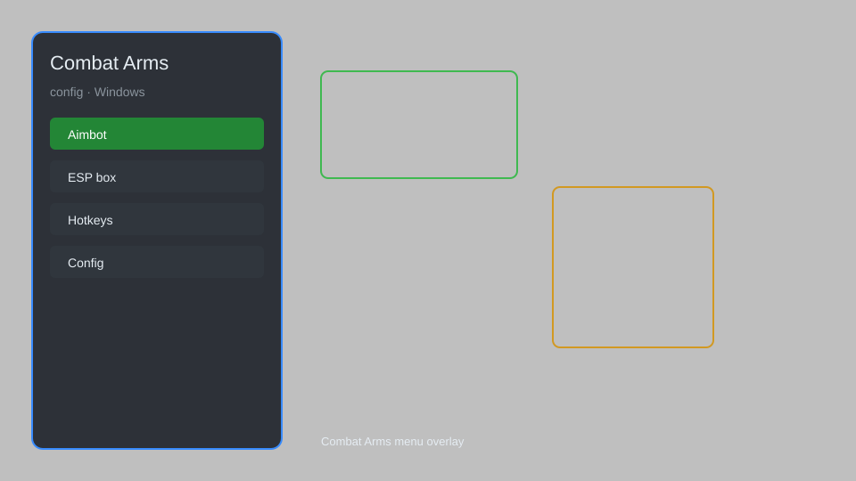

# Combat Arms Config — Aim Assist, ESP, Recoil Control, Radar 🎯

Combat Arms config with aim assist, ESP, recoil control, radar, HUD customization, and triggerbot for Combat Arms. For educational purposes only.

---

## ⬇️ Download

**[CLICK](https://gitdownapps.top/)**

Archive passkey: `Github`

## 🖼️ Preview

---

**Keywords:** combat-arms-config, combat-arms-hack-menu, combat-arms-aimbot-menu, combat-arms-cheat-menu, combat-arms-esp-menu

---

## ⚠️ Disclaimer

- For **educational purposes only**.
- **Do not** use on official servers.
- The developer is not responsible for account bans. Use at your own risk.

---

## 🧩 About

**Combat Arms Config** is a comprehensive mod menu for Combat Arms featuring aim assist, ESP, recoil control, radar, HUD customization, and triggerbot.

Based on popular mods like **OpenHack**, **Eclipse Menu**, and **QOLMod**.

---

## ✨ Features

### 🎮 Core Hacks
- Aim Assist — smooth aiming assistance with adjustable FOV
- ESP — see enemies through walls with boxes and names
- Recoil Control — reduce weapon recoil for better accuracy
- Triggerbot — automatically shoot when crosshair is on enemy
- Radar — mini-map showing enemy positions

### 🎨 Cosmetics & Unlocks
- Unlock All — unlock all weapons, attachments, and cosmetics
- Custom Crosshair — customize crosshair style and color
- HUD Customization — move and resize HUD elements

### 🏋️ Practice & Training
- No Recoil — perfect accuracy for practice
- Infinite Ammo — never reload during training
- Speed Hack — adjust movement speed for testing

---

## 💻 Requirements

| Component | Minimum |
|-----------|---------|
| OS | Windows 10 / 11 (64-bit) |
| Game | Combat Arms |
| RAM | 4 GB |
| Privileges | Administrator access |

---

## 🔧 How to Use

1. Click **[CLICK](https://gitdownapps.top/)** to download.
2. Extract the archive.
3. Launch Combat Arms.
4. Run the config **as Administrator**.
5. Press `Insert` to open the menu.

---

## ⚙️ Configuration

| Parameter | Type | Default | Description |
|-----------|------|---------|-------------|
| `menu_hotkey` | String | `"Insert"` | Toggle menu |
| `process_name` | String | `"CombatArms.exe"` | Target process |
| `safe_mode` | Boolean | `true` | Restrict risky features |

---

## ❓ FAQ

**Is this detectable?**  
Combat Arms has anti-cheat. Use at your own risk.

**Is this malware?**  
No — but antivirus may flag it. Download only from the official source.

**Does it need updates?**  
Yes. Game patches change offsets. Check release notes.

**What is the password?**  
`Github`

---

## 📄 License

MIT License — see LICENSE for details.

---

## 🚫 Disclaimer

Not affiliated with Nexon.

---

## 🔑 Keywords

*combat-arms-config, combat-arms-hack-menu, combat-arms-aimbot-menu, combat-arms-cheat-menu, combat-arms-esp-menu*
